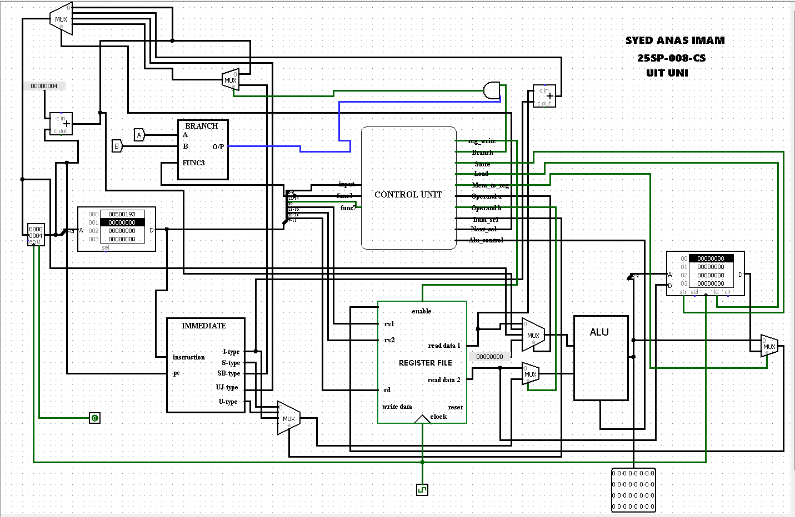

# 32-Bit Single-Cycle RISC-V Processor

Author: Syed Anas Imam  
Roll Number: 25SP-008-CS  
University: UIT (University Institute of Technology)  
Tool: Logisim 2.7.1  

---

## Overview

This repository contains a 32-bit single-cycle processor implementing a subset of the RISC-V RV32I integer instruction set, designed and built in Logisim 2.7.1 for a computer architecture course project at MERL. The processor executes one instruction per clock cycle using a Harvard architecture with separate instruction ROM and data RAM.

The design includes an instruction fetch unit, a 32-word register file, an arithmetic logic unit (ALU), an immediate generator, branch evaluation logic, and control circuitry to route data and instruction execution.

---

## Features

* Single-cycle datapath executing RV32I integer instructions
* Harvard memory organization with dedicated instruction ROM (16 KiB) and data RAM (1 KiB)
* 32 general-purpose registers (x0 to x31), with x0 hardwired to read as zero
* 10 ALU operations selected through a 16-to-1 multiplexer with a 4-bit operation code
* Dedicated 5-bit shift distance extraction from operand B for shift instructions
* Immediate generator supporting I, S, SB, UJ, and U formats
* Branch comparator unit evaluating all six standard branch conditions (BEQ, BNE, BLT, BGE, BLTU, BGEU)
* Direct target calculation adders for branches and unconditional jumps
* Word-aligned memory addressing for instruction fetches and data transfers

---

## Architecture

The processor follows a single-cycle microarchitecture. The top-level schematic (`WHOLE RISCV`) connects all functional blocks in a single combinational path between clocked registers.

```
                    +-----------------------------------------------------------+
                    |                 WHOLE RISCV (Top-Level)                   |
                    |                                                           |
   +------+    +----+-------+    +-------------+    +-------------+             |
   |  PC  |--->| Instruction|--->| Instruction |--->|   Control   |             |
   |(Reg) |    |    ROM     |    |   Splitter  |    |    Unit     |             |
   +---+--+    +------------+    +------+------+    +------+------+             |
       |                                |                  |                    |
       |         +----------------------+------------------+                    |
       |         |                      |                                       |
       v         v                      v                                       |
   +-------+  +-----------+       +-----------+   +-----+   +-----+   +-------+ |
   | PC+4  |  | Immediate |       | Register  |   | MUX |   | ALU |---> Data  | |
   | Adder |  | Generator |       |   File    |-->| A/B |-->|     |   |  RAM  | |
   +-------+  +-----------+       +-----------+   +-----+   +-----+   +-------+ |
                    |                                                           |
                    +-----------------------------------------------------------+
```

---

## Circuit Components

The processor is organized hierarchically in `RISCVUIT.circ`:

```
WHOLE RISCV (Top-level processor schematic)
|-- PC Register (32-bit Logisim register)
|-- PC+4 Adder (32-bit adder with constant 0x4)
|-- Instruction ROM (12-bit address, 32-bit data, 16 KiB)
|-- Instruction Splitter (bit extraction for opcode, rd, funct3, rs1, rs2, funct7)
|-- Control Unit
|   |-- Instype decode (7-bit opcode comparators for 9 instruction types)
|   |-- control decode
|   |   |-- Operand A (ALU input A selection logic)
|   |   |-- Operand B (ALU input B selection logic)
|   |   |-- Next selct (Next-PC selection logic)
|   |   |-- Alu OP (intermediate ALU operation generator)
|   |   +-- Alu control (4-bit ALU operation select logic)
|-- Immediate Generation (bit slicing, extension, and branch/jump adders)
|-- Imm select (4-to-1 immediate selection multiplexer)
|-- Register File (32 registers, dual read multiplexers, write decoder)
|-- Branch Control (6 comparators, 8-to-1 funct3 selection multiplexer)
|-- Operand A MUX (4-to-1 multiplexer: rs1, PC+4, PC, zero)
|-- Operand B MUX (2-to-1 multiplexer: rs2, immediate)
|-- Alu (functional blocks with 16-to-1 output multiplexer)
|-- Data RAM (8-bit address, 32-bit data, separate ports, 1 KiB)
|-- Mem-to-Reg MUX (2-to-1 multiplexer selecting ALU or memory data)
+-- Next-PC MUX (4-to-1 multiplexer for PC update)
```

### Program Counter and Next-PC Logic

The program counter is a 32-bit Logisim register updated on each rising clock edge. The next address is chosen by a 4-to-1 multiplexer at coordinate `(240,30)` using the 2-bit `next_sel` signal:

| Select (`next_sel`) | Source | Target Calculation | Description |
|:-------------------:|:-------|:-------------------|:------------|
| 00 | Sequential | `PC + 4` | Sequential instruction execution |
| 01 | Branch target | `PC + imm_SB` | Selected when a branch condition is met |
| 10 | JAL target | `PC + imm_UJ` | Target address for JAL |
| 11 | JALR target | `rs1 + imm_I` | Computed by ALU for JALR |

The branch condition output is combined with the `branch` control signal through an AND gate at `(1020,160)` to validate conditional branches.

### Register File

The register file contains 32 individual 32-bit registers (x0 to x31):

* Read Ports: Two independent 32-to-1 multiplexers read source registers `rs1` and `rs2` concurrently using 5-bit register addresses.
* Constant Zero (x0): Input 0 of both read multiplexers is tied directly to constant `0x00000000`. Any read from `x0` always returns zero.
* Write Port: A 5-to-32 decoder routes write data to the target register `rd` when the `reg_write` signal is active.
* Clocking: Writes are synchronous and latch data on the rising clock edge.

### Operand Selection Multiplexers

* Operand A MUX: A 4-to-1 multiplexer at `(1130,600)` selects ALU input A using the 2-bit `operand_a` control signal:
  * `00`: `rs1` data from register file
  * `01`: `PC + 4` from sequential adder (used to pass return address for link instructions)
  * `10`: Current `PC` value (used for AUIPC and branch calculations)
  * `11`: Constant `0x00000000` (used for LUI)
* Operand B MUX: A 2-to-1 multiplexer at `(1120,670)` selects ALU input B using the 1-bit `operand_b` control signal:
  * `0`: `rs2` data from register file (R-type instructions)
  * `1`: Immediate value from immediate selector (I-type, load, store, U-type)

### Branch Control Unit

The branch control subcircuit evaluates branch conditions using dedicated hardware comparators:

| funct3 | Branch | Condition | Hardware Logic |
|:------:|:------:|:---------:|:---------------|
| 000 | BEQ | `rs1 == rs2` | Signed comparator equality output |
| 001 | BNE | `rs1 != rs2` | Signed comparator equality inverted by NOT gate |
| 100 | BLT | `rs1 < rs2` (signed) | Signed comparator less-than output |
| 101 | BGE | `rs1 >= rs2` (signed) | Signed comparator greater-or-equal via OR gate |
| 110 | BLTU | `rs1 < rs2` (unsigned) | Unsigned comparator less-than output |
| 111 | BGEU | `rs1 >= rs2` (unsigned) | Unsigned comparator greater-or-equal via OR gate |

An 8-to-1 multiplexer at `(600,340)` selects the branch condition using the instruction's 3-bit `funct3` field.

### Write-Back Datapath

The write-back path routes data to the destination register:

* The 2-to-1 memory-to-register multiplexer at `(1550,620)` selects between the ALU result (`mem_to_reg = 0`) and RAM read data (`mem_to_reg = 1`).
* For jump-and-link instructions, the return address (`PC + 4`) is routed through input 1 of the Operand A multiplexer and passed through the datapath to the register write port.

---

## Instruction Set

The circuit contains decoding logic and datapath wiring for 31 instructions across nine opcode types. Their implementation status is classified into three categories:

* Functionally verified: Confirmed to work as intended through functional execution or dedicated hardware paths.
* Implemented: Hardware execution units and control paths exist in the schematic, but have not been exhaustively tested across all operand ranges.
* Implemented with known limitation: Hardware paths exist, but an implementation quirk or bug affects correct execution under certain conditions.

### R-Type Instructions (Opcode `0110011` / `0x33`)

| Instruction | funct3 | funct7[30] | ALU Code | Operation | Status |
|:-----------:|:------:|:----------:|:--------:|:----------|:------:|
| ADD | 000 | 0 | 0000 | `rd = rs1 + rs2` | Functionally verified |
| SUB | 000 | 1 | 1000 | `rd = rs1 - rs2` | Functionally verified |
| SLL | 001 | 0 | 0001 | `rd = rs1 << rs2[4:0]` | Functionally verified |
| SLT | 010 | 0 | 0010 | `rd = (rs1 < rs2) ? 1 : 0` (signed) | Functionally verified |
| SLTU | 011 | 0 | 0011 | `rd = (rs1 <u rs2) ? 1 : 0` (unsigned) | Functionally verified |
| XOR | 100 | 0 | 0100 | `rd = rs1 ^ rs2` | Functionally verified |
| SRL | 101 | 0 | 0101 | `rd = rs1 >>> rs2[4:0]` | Functionally verified |
| SRA | 101 | 1 | 1101 | `rd = rs1 >> rs2[4:0]` (arithmetic) | Functionally verified |
| OR | 110 | 0 | 0110 | `rd = rs1 | rs2` | Functionally verified |
| AND | 111 | 0 | 0111 | `rd = rs1 & rs2` | Functionally verified |

### I-Type ALU Instructions (Opcode `0010011` / `0x13`)

| Instruction | funct3 | funct7[30] | ALU Code | Operation | Status |
|:-----------:|:------:|:----------:|:--------:|:----------|:------:|
| ADDI | 000 | -- | 0000 | `rd = rs1 + imm` | Functionally verified |
| SLTI | 010 | -- | 0010 | `rd = (rs1 < imm) ? 1 : 0` (signed) | Functionally verified |
| SLTIU | 011 | -- | 0011 | `rd = (rs1 <u imm) ? 1 : 0` (unsigned) | Functionally verified |
| XORI | 100 | -- | 0100 | `rd = rs1 ^ imm` | Functionally verified |
| ORI | 110 | -- | 0110 | `rd = rs1 | imm` | Functionally verified |
| ANDI | 111 | -- | 0111 | `rd = rs1 & imm` | Functionally verified |
| SLLI | 001 | 0 | 0001 | `rd = rs1 << imm[4:0]` | Implemented |
| SRLI | 101 | 0 | 0101 | `rd = rs1 >>> imm[4:0]` | Implemented |
| SRAI | 101 | 1 | 1101 | `rd = rs1 >> imm[4:0]` (arithmetic) | Implemented |

The ALU control unit receives `funct7[30]` to differentiate between SRLI and SRAI.

### Load and Store Instructions

| Instruction | Type | Opcode | funct3 | Operation | Status |
|:-----------:|:----:|:------:|:------:|:----------|:------:|
| LW | I | 0000011 | 010 | `rd = RAM[rs1 + imm]` (32-bit word) | Functionally verified |
| SW | S | 0100011 | 010 | `RAM[rs1 + imm] = rs2` (32-bit word) | Implemented with known limitation |

SW works correctly with positive and zero offsets, but fails with negative offsets due to zero-extension in the immediate generator. Sub-word memory operations (`LB`, `LH`, `LBU`, `LHU`, `SB`, `SH`) are not implemented in the circuit; only 32-bit word transfers are supported.

### Branch Instructions (Opcode `1100011` / `0x63`)

| Instruction | funct3 | Condition | Target Address | Status |
|:-----------:|:------:|:---------:|:---------------|:------:|
| BEQ | 000 | `rs1 == rs2` | `PC + imm_SB` | Functionally verified |
| BNE | 001 | `rs1 != rs2` | `PC + imm_SB` | Functionally verified |
| BLT | 100 | `rs1 < rs2` (signed) | `PC + imm_SB` | Functionally verified |
| BGE | 101 | `rs1 >= rs2` (signed) | `PC + imm_SB` | Functionally verified |
| BLTU | 110 | `rs1 < rs2` (unsigned) | `PC + imm_SB` | Functionally verified |
| BGEU | 111 | `rs1 >= rs2` (unsigned) | `PC + imm_SB` | Functionally verified |

### Upper Immediate Instructions

| Instruction | Type | Opcode | Operation | Status |
|:-----------:|:----:|:------:|:----------|:------:|
| LUI | U | 0110111 | `rd = imm << 12` | Implemented with known limitation |
| AUIPC | U | 0010111 | `rd = PC + (imm << 12)` | Implemented with known limitation |

Due to a shifter wiring issue in the immediate generator, the 20-bit immediate is placed in bits `[19:0]` rather than being shifted left by 12.

### Jump Instructions

| Instruction | Type | Opcode | Operation | Status |
|:-----------:|:----:|:------:|:----------|:------:|
| JAL | UJ | 1101111 | `rd = PC + 4; PC = PC + imm_UJ` | Implemented |
| JALR | I | 1100111 | `rd = PC + 4; PC = (rs1 + imm_I) & ~1` | Implemented |

Jump target adders and the `PC + 4` return address path to the write-back multiplexer network are confirmed in the circuit schematic.

---

## Instruction Execution

During each clock cycle, the processor progresses through the standard single-cycle stages:

1. Instruction Fetch: The PC supplies a word-aligned address to the instruction ROM to retrieve the 32-bit instruction word. A dedicated adder computes `PC + 4` in parallel.
2. Instruction Decode: The instruction splitter extracts opcode, register addresses, function codes, and immediate fields. The control unit decodes the opcode to produce datapath select and write-enable signals, and the immediate generator reconstructs immediate values.
3. Register Read: The register file outputs values for source registers `rs1` and `rs2` from its dual read ports.
4. Execute: Operand multiplexers route the appropriate inputs to the ALU (register values, immediate values, PC, or constant zero). The ALU computes the arithmetic or logical result, while the branch unit compares `rs1` and `rs2`.
5. Memory Access: For load instructions (`LW`), data is read from data RAM at the address computed by the ALU. For store instructions (`SW`), data from `rs2` is written to RAM.
6. Write-Back: The memory-to-register multiplexer selects either the ALU result or RAM read data, and the selected value is written to destination register `rd`.
7. PC Update: The next-PC multiplexer selects sequential `PC + 4`, branch target, JAL target, or JALR target. The new address is latched on the next rising clock edge.

---

## Memory Organization

The processor uses separate instruction and data memories (Harvard architecture):

### Instruction Memory (ROM)

* Component: Logisim ROM at `(430,410)`
* Address Width: 12 bits (4096 words, 16 KiB total capacity)
* Data Width: 32 bits
* Addressing: A splitter at `(260,420)` takes bits `[13:2]` from the PC to drive the ROM address. Discarding bits `[1:0]` guarantees word alignment.

### Data Memory (RAM)

* Component: Logisim RAM at `(1490,490)`
* Address Width: 8 bits (256 words, 1 KiB total capacity)
* Data Width: 32 bits
* Bus Interface: Separate read and write data ports (`bus=separate`)
* Addressing: A splitter at `(1280,500)` takes bits `[9:2]` from the ALU output. Discarding bits `[1:0]` enforces word alignment.
* Control: Writes are enabled by the `store` control signal and clocked on the rising edge.

---

## Control Unit

The control unit decodes the 7-bit opcode with nine comparators and generates all datapath control signals:

| Signal | Width | Destination | Function |
|--------|:-----:|-------------|----------|
| `reg_write` | 1 bit | Register File | Enables writing write-back data to `rd` |
| `branch` | 1 bit | Branch AND Gate | Indicates a conditional branch instruction |
| `store` | 1 bit | Data RAM | Enables synchronous data write to RAM |
| `load` | 1 bit | Control Path | Indicates memory read operation |
| `mem_to_reg` | 1 bit | Write-Back MUX | Selects ALU result (0) or RAM read data (1) |
| `operand_a` | 2 bits | Operand A MUX | Selects `rs1` (00), `PC+4` (01), `PC` (10), or zero (11) |
| `operand_b` | 1 bit | Operand B MUX | Selects `rs2` data (0) or immediate (1) |
| `imm_sel` | 2 bits | Immediate MUX | Selects immediate format to route to datapath |
| `next_sel` | 2 bits | Next-PC MUX | Selects `PC+4` (00), branch (01), JAL (10), or JALR (11) |
| `alu_control` | 4 bits | ALU Output MUX | Controls the 16-to-1 ALU operation multiplexer |

---

## ALU

The ALU computes operations in parallel and selects the result using a 16-to-1 multiplexer at coordinate `(1140,510)` driven by the 4-bit `alu_control` code.

There are 10 active operations implemented, and 6 multiplexer positions are unconnected:

| Select Code | Operation | Underlying Hardware Component | Multiplexer Pin | Status |
|:-----------:|:---------:|:------------------------------|:---------------:|:------:|
| 0000 (0x0) | ADD | 32-bit Adder at `(630,290)` | `(1100,430)` | Active |
| 0001 (0x1) | SLL | 32-bit Left Logical Shifter at `(630,350)` | `(1100,440)` | Active |
| 0010 (0x2) | SLT | 32-bit Signed Comparator at `(630,410)` + Extender | `(1100,450)` | Active |
| 0011 (0x3) | SLTU | 32-bit Unsigned Comparator at `(630,460)` + Extender | `(1100,460)` | Active |
| 0100 (0x4) | XOR | 32-bit XOR Gate at `(650,550)` | `(1100,470)` | Active |
| 0101 (0x5) | SRL | 32-bit Right Logical Shifter at `(630,620)` | `(1100,480)` | Active |
| 0110 (0x6) | OR | 32-bit OR Gate at `(650,690)` | `(1100,490)` | Active |
| 0111 (0x7) | AND | 32-bit AND Gate at `(640,760)` | `(1100,500)` | Active |
| 1000 (0x8) | SUB | 32-bit Subtractor at `(630,830)` | `(1100,510)` | Active |
| 1001 (0x9) | Unused | No connection | `(1100,520)` | Open |
| 1010 (0xA) | Unused | No connection | `(1100,530)` | Open |
| 1011 (0xB) | Unused | No connection | `(1100,540)` | Open |
| 1100 (0xC) | Unused | No connection | `(1100,550)` | Open |
| 1101 (0xD) | SRA | 32-bit Right Arithmetic Shifter at `(610,900)` | `(1100,560)` | Active |
| 1110 (0xE) | Unused | No connection | `(1100,570)` | Open |
| 1111 (0xF) | Unused | No connection | `(1100,580)` | Open |

For shift operations (`SLL`, `SRL`, `SRA`), splitters at `(520,370)` and `(510,640)` extract bits `[4:0]` of operand B, matching the standard RISC-V 5-bit shift distance specification.

---

## Testing

### Default ROM Program

The ROM contains a pre-loaded test instruction at address `0x000`:

```
Address 0x000: 0x00500193 -> addi x3, x0, 5
```

Stepping the clock by one tick produces the following state:
* Register `x3` updates to `0x00000005`.
* The PC advances from `0x00000000` to `0x00000004`.

### Sample Verification Instructions

The following instruction sequence can be loaded into ROM to test arithmetic, memory, and register updates:

| Address | Hex Code | Assembly | Description |
|:-------:|:--------:|:---------|:------------|
| `0x000` | `0x00500193` | `addi x3, x0, 5` | Load 5 into register x3 |
| `0x004` | `0x00A00213` | `addi x4, x0, 10` | Load 10 into register x4 |
| `0x008` | `0x004181B3` | `add x3, x3, x4` | `x3 = 5 + 10 = 15` |
| `0x00C` | `0x40418133` | `sub x2, x3, x4` | `x2 = 15 - 10 = 5` |
| `0x010` | `0x003220A3` | `sw x3, 1(x4)` | Store value 15 at word address |
| `0x014` | `0x00122083` | `lw x1, 1(x4)` | Load value 15 back into register x1 |

---

## Known Limitations

1. U-type immediate shift amount: In the `Immediate Generation` subcircuit, the left shifter at `(620,510)` has its shift distance input wired to constant `0x0` rather than `0xC` (12). As a result, the 20-bit immediate is placed in bits `[19:0]` rather than being shifted into bits `[31:12]`. This directly impacts `LUI` and `AUIPC`.
2. S-type immediate zero-extension: The Bit Extender at `(430,210)` lacks the `type=sign` attribute, so Logisim defaults to zero-extension. Store instructions (`SW`) with positive or zero offsets work as expected, but negative offsets will compute an unexpected target address.
3. Word-only memory operations: The RAM interface is 32 bits wide without byte-enable logic. Sub-word operations (`LB`, `LH`, `LBU`, `LHU`, `SB`, `SH`) are not supported.
4. Memory capacity: The instruction ROM contains 4096 words (16 KiB), and the data RAM contains 256 words (1 KiB).
5. Single-cycle timing: Every instruction completes in a single cycle. The clock frequency must accommodate the longest combinational path through ROM, register file, ALU, RAM, and write-back logic.
6. Missing instructions: System and synchronization instructions (`ECALL`, `EBREAK`, `FENCE`), CSR registers, and the M extension (multiply/divide) are not implemented.

---

## Verification Notes

The circuit schematics in `RISCVUIT.circ` were verified by tracing component placements, multiplexer pin assignments, and wire paths across all subcircuits:

* Opcode comparators: Nine comparators in `Instype decode` confirm individual detection for R, I (ALU), Load, Store, Branch, LUI, AUIPC, JAL, and JALR opcodes.
* ALU multiplexer mapping: All 16 inputs of the multiplexer at `(1140,510)` were traced to their source components, confirming 10 active operations and 6 unused pins (indices 9 to 12, 14, and 15).
* Shift distance extraction: Dedicated splitters at `(520,370)` and `(510,640)` confirm that only bits `[4:0]` of operand B are supplied to the shifters.
* Branch logic: The presence of six comparators (signed and unsigned) and the funct3-driven multiplexer at `(600,340)` confirm hardware support for all six branch conditions.
* Write-back paths: Operand A MUX at `(1130,600)` includes `PC + 4` at input 1, providing a return address path for jump instructions. Mem-to-Reg MUX at `(1550,620)` selects between the datapath result and RAM read data.
* Scope note: While the functional blocks and datapath wiring were verified directly from the schematic, exhaustive simulation across all 128 input permutations of the multi-gate ALU control logic was not performed.

---

## Project Structure

```
RiSCV UIT Anas/
|-- RISCVUIT.circ                    # Main Logisim circuit file
|-- RISCV Logisim.png                # Top-level circuit diagram
|-- RISC-V-Reference-Data-Green-Card.pdf # RISC-V ISA reference card
+-- README.md                        # Project documentation
```

All subcircuits are embedded directly in `RISCVUIT.circ`; no external Logisim library files are required.

---

## How to Run

1. Open Logisim 2.7.1.
2. Go to File > Open and select `RISCVUIT.circ`.
3. In the left project explorer panel, double-click WHOLE RISCV to open the top-level circuit.
4. To load machine code:
   * Right-click the Instruction ROM component.
   * Select Edit Contents.
   * Enter 32-bit hex instruction words starting at address `0x000`.
5. Run the clock:
   * Press `Ctrl + K` to enable automatic clock ticks.
   * Adjust simulation speed under Simulate > Tick Frequency.
   * Press `Ctrl + T` to step clock ticks manually.
6. Inspect state:
   * Use the Poke Tool (hand icon) to click on wires or inspect register values.
   * Double-click the Register File or Data RAM subcircuits to check stored contents.

---

## Circuit Diagram



*Complete single-cycle datapath schematic in Logisim showing fetch, decode, register file, ALU, memory, and control blocks.*

---

## Future Improvements

* Fix the shift constant in the U-type immediate path (change `0x0` to `0xC` for 12-bit shift).
* Configure the S-type bit extender to use sign extension.
* Add byte and halfword memory masking and sign/zero extension for sub-word transfers.
* Implement a 5-stage pipeline (IF, ID, EX, MEM, WB) with hazard detection and forwarding.
* Expand the data RAM capacity and add memory-mapped I/O peripherals.
* Port the schematic to Logisim-Evolution.

---

## Author

Syed Anas Imam  
Roll Number: 25SP-008-CS  
University Institute of Technology (UIT)  

---

## References

* Patterson, D. A., & Hennessy, J. L., *Computer Organization and Design: The RISC-V Edition*, Morgan Kaufmann.
* RISC-V Foundation, *The RISC-V Instruction Set Manual, Volume I: User-Level ISA*.
* RISC-V Reference Data ("Green Card"), included in repository as `RISC-V-Reference-Data-Green-Card.pdf`.